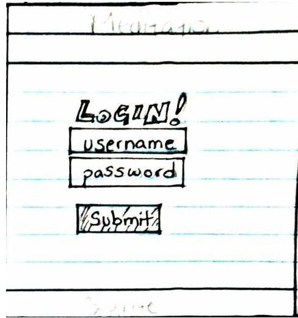
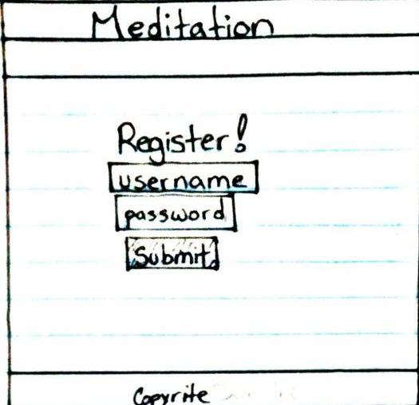
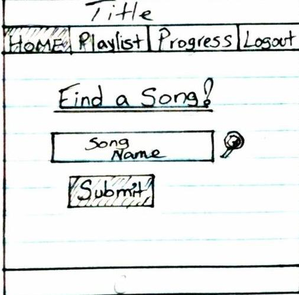
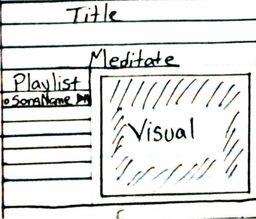
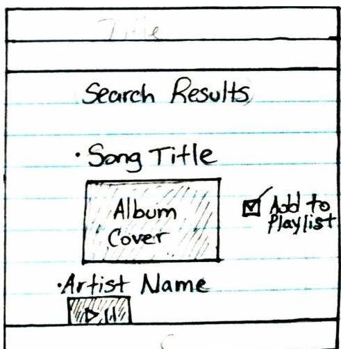

## Meditation App
### Dan Martin
#### Thesis Project


### The technologies I used are:
  * React
  * React-Redux
  * MongoDB
  * Express
  * OAuth with Spotify API and Google API

I am a big fan of react, and was initially planning on using plain react for my frontend, but after spending so much time using react and hearing about redux with react I was eager to do research on my own after this class ended. However, I decided this would be the perfect opportunity to do that. So I did some research on react-redux, and while doing so I decided I would also teach myself how to use Mongo for my database. On top of all of that, this is my first time implementing an OAuth API.

I went through some huge learning curves with all of these new technologies. Redux is awesome, however it can be quite confusing at first. Especially using APIs with OAuth, and Spotify's specifically which requires users access tokens on every call. I tried out a few new NPM packages and cool ES6 tricks I came across during my research.

##### users can now search with youtube and spotify, and I made the playlist flow more functional. Users can now click on a playlist after it renders and they are then given items from that playlist. I am currently working on the next steps to get songs and artists etc from those playlists, and then the same with genres.
### More improvements all spotify search methods are complete with ability to click through playlists, genres, artists and play the songs from each respective search method. aside from the artist, selecting an artist only allows you a link to that artists spotify profile, thats just how the spotify API works. Did a lot of refactoring with the store and middleware, and handling the users accesstoken in local storage now instead of having to pass it to the action creators every time they want to make a request. 


### Installation instructions for any dependencies
yarn install in the root folder, cd in to the client folder, yarn install in the client folder. cd .. back to the root folder and run `npm run dev`

### Descriptions of any unsolved problems or major hurdles you had to overcome

There is still a lot I want to do with this, and I plan on continuing to work on it, I am now a big fan of redux with react. It took a long time to get things working while figuring it all out, so my actions and reducers have some room for improvement, and with some more practice I know I will be able to DRY up the code a lot and add more features.

Some unsolved problems right now are my API calls and the repetition of the actions and methods, I know there is a way to clean it up I'm just trying to figure out how to implement them exactly.

There were a lot of hurdles that took me quite some time to solve. For example, handling the OAuth system with mongo, and storing the users data, including their access and refresh tokens to then later use in the API calls. Furthermore, using those access tokens specific to the user that is currently logged in, in the action creators when fetching from the API. Handling all of the states in the store got hairy and confusing at times. The whole system of global state, action creators, async promises, dispatching information to reducers, switch statements from those dispatched actions, and returning states based on cases, otherwise returning default state, all handled in the global state store.. Theres also some improvements I want to make to my use of Mongo, I know theres some more I can do with it, especially in terms of making the users experience much more personalized. I really want to let users CRUD everything to their actual Spotify accounts, and let them keep a log of their progress, which I already somewhat implemented, but not fully.

~~I got the YouTube/Google OAuth to work, yet haven't had enough time to let users search yet, I know exactly how I am going to do it, so I will get to it soon.~~


#### User stories

- On initial render of home page, users will be prompted to login through their spotify or google accounts, once successfully logged in, they are redirected to their home page (/home).
- On the home screen, they have the option to search through Spotify or Youtube's API's
- They can search through artists, songs, playlists or genres on Spotify, and anything on Youtube.
- They will soon be able to set goals for their meditations and keep track of them, as well as keep track of the meditations they liked

## Code flow I like
### Button to call action creator,
```
<button 
type="button"
disabled={!this.state.input}
className="btn btn-success"
onClick={() => this.props.actions.fetchPlaylist(input, accessToken)}> Search for a Playlist </button>
```
improved to

```
<Link
  to="/spotify/playlist"
  disabled={!this.state.input}
  className="btn btn-success"
  onClick={() => fetchPlaylist(input)} >
```
### Action creator to fetch the playlist,
```
export const fetchPlaylist = (input, accessToken) => async dispatch => {
  const FETCH_URL = `${BASE_URL}q=${input}&type=playlist`;
  const headers = {
    Authorization: "Bearer " + accessToken
  };
  const res = await axios.get(FETCH_URL, {
    method: "get",
    headers: headers
  });
  dispatch({ type: actions.FETCH_PLAYLIST, payload: res.data });
};
```
improved to

```

export const fetchPlaylist = input => async dispatch => {
  const FETCH_URL = `${BASE_URL}q=${input}&type=playlist`;
  const res = await axios.get(FETCH_URL, fetch);
  dispatch({ type: actions.FETCH_PLAYLIST, payload: res.data.playlists });
};
```
### Then once playlist renders, users can select from the playlists that rendered,
```
<PlaylistContainer
              key={index}
              onClick={() =>
                this.props.actions.selectedPlaylist(url, accessToken)}
            >
```
improved to 

```
<PlaylistContainer
        key={item.id}
        onClick={() => selectedPlaylist(item.url)}
      >
        <Link to={`/spotify/playlist/${item.name}`}>
```
### Then the action creator to fetch the selected playlist,
```
export const selectedPlaylist = (url, accessToken) => async dispatch => {
  const headers = {
    Authorization: "Bearer " + accessToken
  };
  const res = await axios.get(url, {
    method: "get",
    headers: headers
  });
  dispatch({ type: actions.SELECTED_PLAYLIST, payload: res.data });
};
```
```
improved to
export const selectedPlaylist = url => async dispatch => {
  const res = await axios.get(url, fetch);
  dispatch({ type: actions.SELECTED_PLAYLIST, payload: res.data });
};
```
### The action creators dispatch to the reducers, with the help of redux thunk to dispatch instead of just return in the action,
```
export default function(state = null, action) {
  switch (action.type) {
    case FETCH_PLAYLIST:
      return action.payload;
    case SELECTED_PLAYLIST:
      return action.payload;
    default:
      return state;
  }
}
```
improved to
```
export default function(state = initialState.spotify, action) {
  // console.log("reducer fetch playlist -> ", action.payload);
  switch (action.type) {
    case actions.FETCH_PLAYLIST:
      return {
        ...state,
        items: action.payload.items.map(item => {
          return {
            trackImg: item.images[0].url,
            url: item.tracks.href,
            name: item.name,
            tracks: item.tracks.href,
            id: item.id
          };
        }),
        selectedGenre: [],
        selectedArtist: [],
        selectedPlaylist: [],
        success: true,
        error: null,
        isLoading: false
      };
    case actions.SELECTED_PLAYLIST:
      return {
        ...state,
        items: [],
        selectedPlaylist: action.payload.items.map(item => {
          return {
            track: item.track,
            album: item.track.album,
            trackImg: item.track.album.images[0].url,
            uri: item.track.uri,
            preview_url: item.track.preview_url
          };
        }),
        selectedGenre: [],
        selectedArtist: [],
        success: true,
        error: null,
        isLoading: false
      };
    case actions.CLEAR_SEARCH:
      return initialState;
    default:
      return state;
  }
}
```
### It is then combined in the combine reducers,
```
export default combineReducers({
  auth,
  artist,
  song,
  playlist,
  genre,
  logs,
  youtube
});
```
### And sent to the store in the main client index.js
```
const store = createStore(reducers, {}, applyMiddleware(reduxThunk));

ReactDOM.render(
  <Provider store={store}>
    <App />
  </Provider>,
  document.querySelector("#root")
);
```

which is now
```
const Root = ({ store }) => (
  <Provider store={store}>
    <App />
  </Provider>
);
```
#### That is the beauty of states in redux

**Login Page**



**Home Page**


**Playlist**


**Search**



  **Phase -2**
* File Structure
* Db structure
* Git Repo

**Phase -1**
* Express / react routes
* Set up auth
* Create components
* Structure for front end

**Phase 0** *MVP*
* Successfully getting info from API
* Users can search and save songs
* Users can set goals

**Phase 1**
* Animations
* Use Youtube and Spotify API

**Phase 2**
* Multiple Users
* User profile pictures
